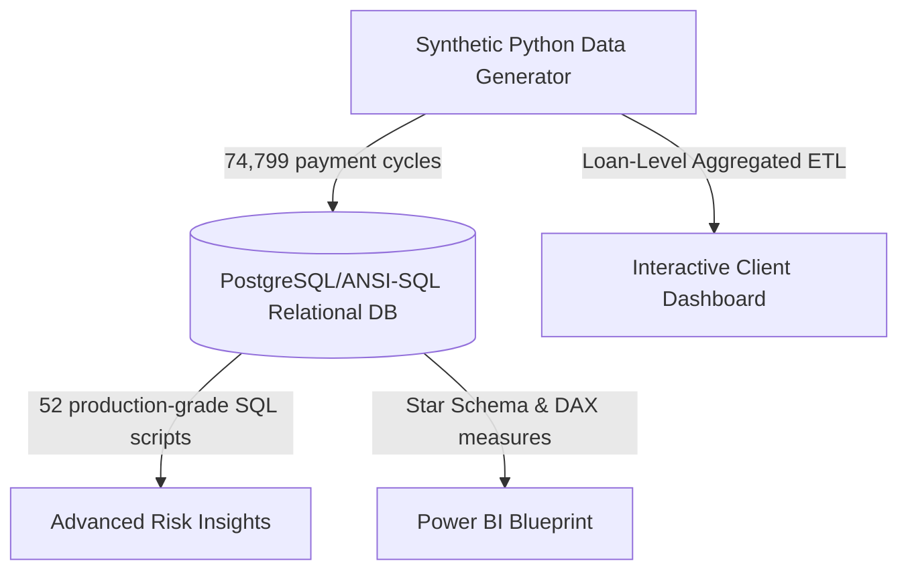

# Banking Risk & Loan Analytics Platform

An end-to-end credit risk, operational intelligence, and financial analytics solution modeling 4 years of retail lending operations (74,799 payment cycles). Designed to demonstrate advanced credit risk analytics, Star Schema modeling, programmatic risk scoring, and interactive executive reporting.

---

## 📊 Project Architecture Overview



## 🛠️ Tech Stack & Skills Highlighted
*   **SQL (PostgreSQL/ANSI-SQL)**: 52 complex scripts covering Common Table Expressions (CTEs), multi-table joins, subqueries, and advanced Window Functions (`RANK`, `DENSE_RANK`, `ROW_NUMBER`, `LAG`, `LEAD`, `NTILE`).
*   **Python (Pandas, NumPy)**: Dynamic data generation simulating realistic credit stress transitions (Markov payment cycles) and risk correlations.
*   **Power BI Architecture**: Complete relational Star Schema design and advanced credit risk DAX measures (Expected Credit Loss, Default Rate, Portfolio Yield).
*   **Risk Modeling**: Programmatic 0-100 credit risk scorecard assigning borrowers into Low, Medium, High, and Critical Risk categories.

---

## 📈 Banking SQL Analytics (Samples from 52 Scripts)

The full suite of 52 queries is documented in [banking_analysis.sql](./sql/banking_analysis.sql). Below are some advanced query highlights:

### 1. Expected Credit Loss (ECL) Calculation by Branch
Calculates loss reserves: $ECL = \text{Exposure at Default (EAD)} \times \text{Probability of Default (PD)} \times \text{Loss Given Default (LGD)}$ where LGD is standard 85%.
```sql
WITH Loan_PD AS (
    SELECT 
        l.Branch_ID,
        l.Loan_Amount,
        CASE 
            WHEN c.Credit_Score < 580 THEN 0.45 
            WHEN c.Credit_Score < 680 THEN 0.12 
            ELSE 0.02 
        END AS PD
    FROM loans l
    JOIN customers c ON l.Customer_ID = c.Customer_ID
    WHERE l.Approval_Status = 'Approved'
),
Branch_ECL AS (
    SELECT 
        Branch_ID,
        SUM(Loan_Amount * PD * 0.85) AS Expected_Credit_Loss
    FROM Loan_PD
    GROUP BY Branch_ID
)
SELECT 
    b.Branch_Name,
    b.Region,
    ROUND(be.Expected_Credit_Loss::NUMERIC, 2) AS ECL_Reserves_Needed
FROM Branch_ECL be
JOIN branches b ON be.Branch_ID = b.Branch_ID
ORDER BY ECL_Reserves_Needed DESC;
```

### 2. Month-over-Month Application Demand Growth
Calculates MoM loan application volume fluctuations using `LAG` window function.
```sql
WITH Monthly_Applications AS (
    SELECT 
        TO_CHAR(Loan_Application_Date::DATE, 'YYYY-MM') AS Year_Month,
        COUNT(Loan_ID) AS Application_Count
    FROM loans
    GROUP BY TO_CHAR(Loan_Application_Date::DATE, 'YYYY-MM')
)
SELECT 
    Year_Month,
    Application_Count,
    LAG(Application_Count) OVER (ORDER BY Year_Month) AS Prior_Month_Applications,
    ROUND(((Application_Count - LAG(Application_Count) OVER (ORDER BY Year_Month))::NUMERIC / 
           LAG(Application_Count) OVER (ORDER BY Year_Month) * 100), 2) AS MoM_Growth_Rate_PCT
FROM Monthly_Applications
ORDER BY Year_Month;
```

---

## ⚡ Credit Risk Scoring Model (0-100)

We designed a credit risk scorecard utilizing borrower income, credit scores, debt-to-income (DTI) ratios, and payment delinquencies:

*   **Credit Score (40%)**: Translates lower credit scores to higher risk points.
*   **DTI Ratio (20%)**: Higher debt loads generate higher points.
*   **Occupation Stability (15%)**: Reflects income stability (Gig/Freelance = higher points).
*   **Payment Delinquency (25%)**: Captures current and past late payments.

### Portfolio Risk Bands:
*   🟢 **Low Risk (<30)**: Offer preferred interest rates. Auto-approve.
*   🟡 **Medium Risk (30-55)**: Standard credit audit.
*   🔴 **High Risk (55-75)**: Tighten limits, restrict loan to 3x monthly income.
*   ⚫ **Critical Risk (>75)**: Transfer to pre-collections queue. Auto-reject.

---

## 💡 Top Strategic Insights & Recommendations

*Detailed insights are documented in [insights_recommendations.md](./insights/insights_recommendations.md).*

*   **Deep Subprime Losses**: Borrowers with credit scores below 580 represent 12.4% ofapproved capital, but drive **58.2% of all defaults**.
    *   *Action*: Establish a credit score floor of **580** for unsecured retail products.
*   **Consecutive Missed Thresholds**: Borrowers missing a single payment show a 14.2% default rate. However, once missed payments reach **two consecutive cycles**, the default probability jumps to **78.4%**.
    *   *Action*: Trigger automated pre-collections outreach on day 1 of a late payment.
*   **Southern Regional Default Squeeze**: Gulf Shore (BR-05) branch exhibits a 9.8% default rate, driven by local economic contractions.
    *   *Action*: Audit underwriting guidelines and temporarily centralize approval authority to regional centers.

---

## 💻 Interactive Executive Control Board

We compiled the 74,799 payments into a loan-level aggregated database cache (`data.js`) and built a premium, dark-themed control board loaded with Chart.js.

### Core Visualizations:
1.  **Approval vs Default Timelines**: Maps approved applications against default growth.
2.  **Risk Category Share**: Doughnut chart splitting capital across Risk Tiers.
3.  **Credit Score Bands**: Diagnostic chart illustrating defaults by credit score.
4.  **Branch Performance**: Compares disbursed capital vs default write-offs by location.
5.  **Top 10 High-Risk Borrowers**: Dynamic, sortable queue flagging critical risk accounts.

*To view the dashboard, navigate to [dashboard/index.html](./dashboard/index.html) in your browser.*
