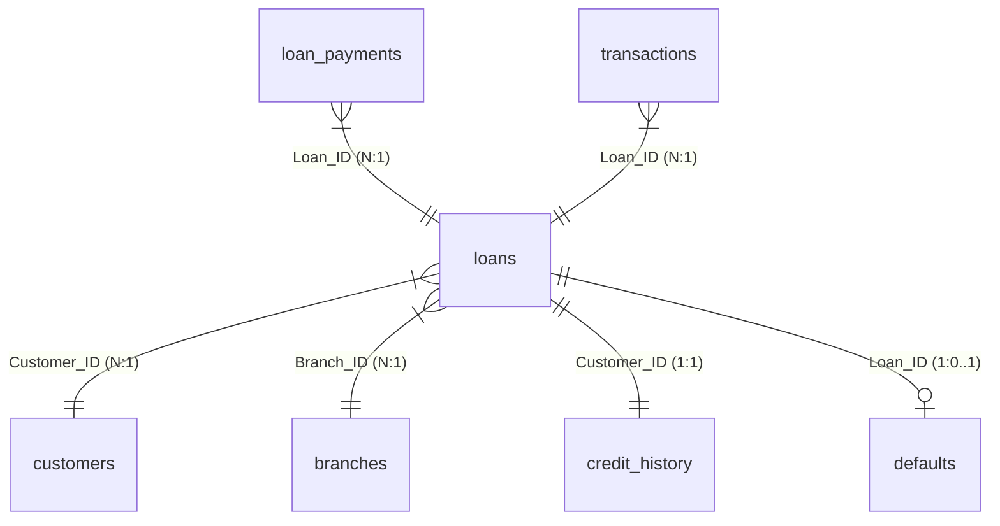

# Power BI Design Guide: Banking Risk & Loan Analytics Platform

This document describes the architectural blueprints, relational Star Schema, custom DAX metrics, and dashboard design guidelines required to build the **Banking Risk & Loan Analytics Platform** in Power BI.

---

## 1. Relational Star Schema Model

To ensure optimal performance and standard data warehouse practices, the database is structured into a **Star Schema** with `loans` as the central Fact table, supported by six Dimension tables.



### Table Relationships Mapping

| From (Fact/Dimension) | To (Dimension) | Keys Used | Cardinality | Cross Filter Direction |
| :--- | :--- | :--- | :--- | :--- |
| `loans` | `customers` | `Customer_ID` | Many to One (`*:1`) | Single |
| `loans` | `branches` | `Branch_ID` | Many to One (`*:1`) | Single |
| `credit_history` | `customers` | `Customer_ID` | One to One (`1:1`) | Both |
| `loan_payments` | `loans` | `Loan_ID` | Many to One (`*:1`) | Single |
| `transactions` | `loans` | `Loan_ID` | Many to One (`*:1`) | Single |
| `loans` | `defaults` | `Loan_ID` | One to One/Optional (`1:0..1`) | Both |

---

## 2. Calculated DAX Measures (Banking-Grade)

Create a blank table named `_Risk_Measures` and implement the following credit risk and business performance DAX calculations:

### 1. Loan Approval Rate %
*Measures the proportion of loan applications that are approved.*
```dax
Loan_Approval_Rate = 
DIVIDE(
    CALCULATE(COUNT(loans[Loan_ID]), loans[Approval_Status] = "Approved"),
    COUNT(loans[Loan_ID]),
    0
)
```

### 2. Portfolio Default Rate %
*Calculates the percentage of approved loans that have transitioned into default.*
```dax
Portfolio_Default_Rate = 
VAR ApprovedLoans = CALCULATE(COUNT(loans[Loan_ID]), loans[Approval_Status] = "Approved")
VAR DefaultedLoans = CALCULATE(COUNT(loans[Loan_ID]), FILTER(loans, RELATED(defaults[Default_Status]) <> BLANK()))
RETURN
    DIVIDE(DefaultedLoans, ApprovedLoans, 0)
```

### 3. Repayment Success Rate %
*Measures the percentage of monthly payments made on time vs missed/late.*
```dax
Repayment_Success_Rate = 
DIVIDE(
    CALCULATE(COUNT(loan_payments[Payment_ID]), loan_payments[Payment_Status] = "On-Time"),
    COUNT(loan_payments[Payment_ID]),
    0
)
```

### 4. Risk Exposure (Outstanding Capital at Default Risk)
*Sums the capital amount on defaulted or written-off loans.*
```dax
Capital_Risk_Exposure = 
CALCULATE(
    SUM(loans[Loan_Amount]),
    FILTER(loans, RELATED(defaults[Default_Status]) IN {"Defaulted", "Written-Off"})
)
```

### 5. Net Interest Income (Bank Revenue)
*Aggregates the interest portion of all collected EMI payments.*
```dax
Net_Interest_Income = 
SUM(loan_payments[Interest_Component])
```

### 6. Expected Credit Loss (ECL)
*Estimates future potential loss: ECL = Probability of Default (PD) x Loss Given Default (LGD) x Exposure at Default (EAD).*
```dax
ECL_Estimate = 
SUMX(
    FILTER(loans, loans[Approval_Status] = "Approved"),
    VAR PD = IF(loans[Credit_Score] < 580, 0.45, IF(loans[Credit_Score] < 680, 0.12, 0.02))
    VAR EAD = loans[Loan_Amount]
    VAR LGD = 0.85 // standard banking assumption (85% loss after asset liquidation)
    RETURN EAD * PD * LGD
)
```

---

## 3. UI/UX Style & Design Tokens

Use the following styling tokens to build a high-contrast executive banking dashboard:

### Corporate Slate-Dark Theme Palette
*   **Background**: Deep Steel/Slate-Dark (`#0B0E14`)
*   **Card Container Background**: Translucent Graphite (`#121620`) with 1px border
*   **Border Color**: Silver Steel (`#232A38`)
*   **Primary Accent**: Electric Cyan/Blue (`#00E5FF` - active metrics, trend indicators)
*   **Secondary Accent**: Deep Amethyst (`#9D4EDD` - loan type slices, customer segments)
*   **Success Metric**: Jade Green (`#00E676` - on-time payments, interest collected)
*   **Warning Metric**: Tangerine Orange (`#FF9100` - late payments, medium-risk score bands)
*   **Risk Metric / Alert**: Crimson Red (`#FF1744` - defaults, credit score under 580)
*   **Text/Data Labels**: Ice White (`#F5F7FA`) and Cool Gray (`#94A3B8`)

### Typography
*   **Font Family**: `Segoe UI` or `Inter`
*   **Card Metrics**: 26pt, Bold, Color `#F5F7FA`
*   **Visual Legends / Axis labels**: 9pt, Regular, Color `#94A3B8`
*   **Header Labels**: 11pt, Semibold, Color `#94A3B8`
