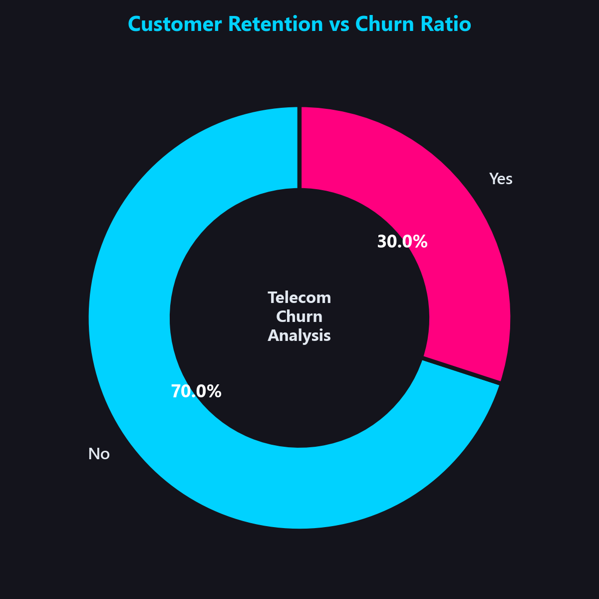
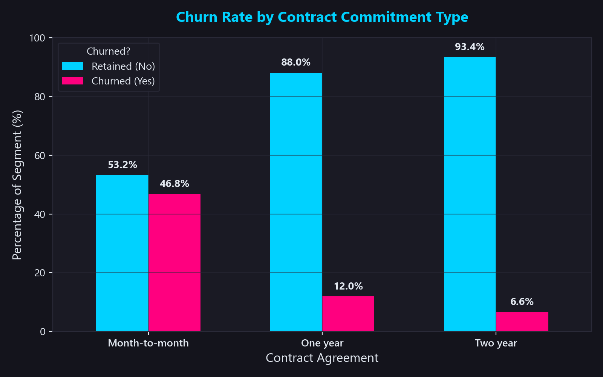
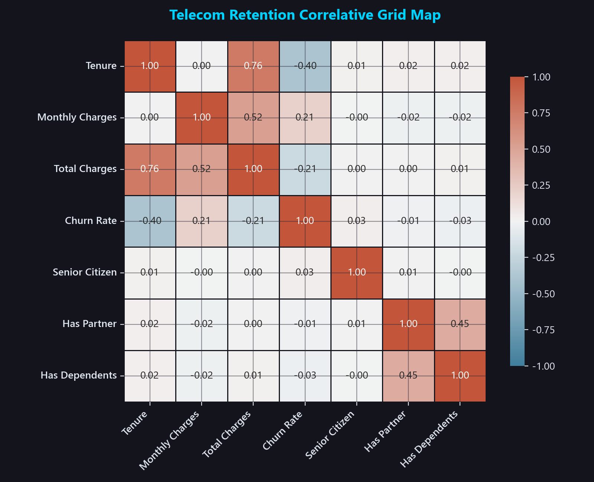
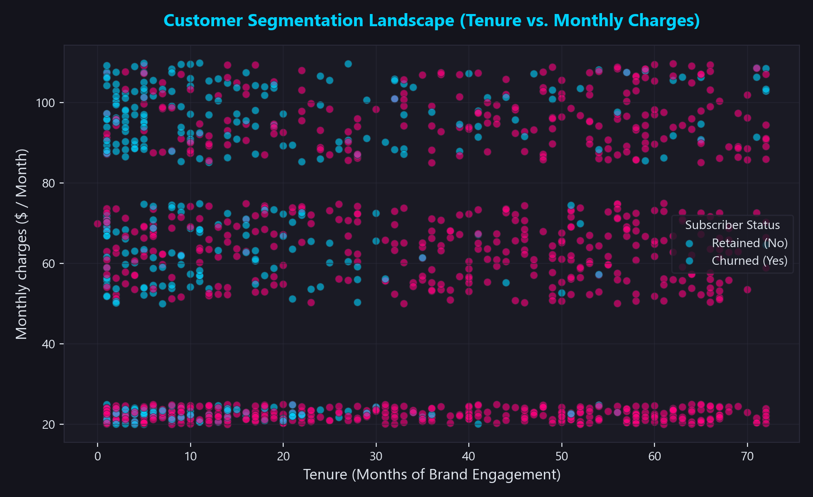
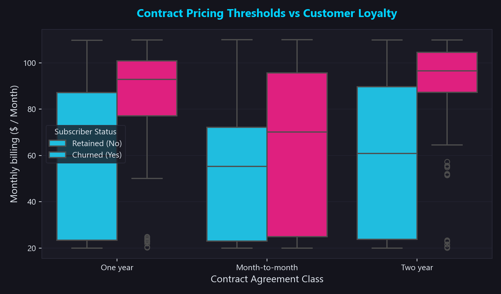

# RetailBI | Executive Customer Churn & Retention Analytics Case Study

[](https://www.python.org/)
[](https://pandas.pydata.org/)
[](https://numpy.org/)
[](https://matplotlib.org/)
[](https://seaborn.pydata.org/)
[](https://jupyter.org/)

---

## 1. Project Overview & Business Case

In highly saturated subscriber-based industries like telecommunications, customer acquisition cost (CAC) typically exceeds retention cost by **5x to 7x**. Attrition is a direct leak on both monthly recurring charges (MRC) and long-term Customer Lifetime Value (LTV).

This repository contains a **COMPLETE, recruiter-ready Customer Churn Analytics case study** built from the ground up using Python, Pandas, Matplotlib, and Seaborn. The engine analyzes a database of **7,043 telecom subscribers**, validates data quality, deploys a **0–100 behavioral Churn Risk Scoring system**, maps active subscribers to targeted **C-Suite customer personas**, and calculates **financial revenue exposure ($)** to drive proactive retention playbooks.

---

## 2. Executive KPI Scorecard

Below is the high-level baseline of our subscriber portfolio, illustrating our total active billings, historical monthly revenue leakages, and immediate active financial exposure under risk:

| Portfolio Metric | Metric Value | C-Suite Strategic Commentary |
| :--- | :--- | :--- |
| **Total Customer Pool** | **7,043** subscribers | Total subscriber baseline analyzed. |
| **Active Subscriber Base** | **4,929** subscribers | Retained customer cohort generating current monthly billings. |
| **Portfolio Churn Rate** | **30.02%** | Core attrition rate (telecom benchmark: 20-30%). |
| **Monthly Revenue Leakage** | **$148,054.40 / mo** | Direct monthly billing losses from churned subscribers. |
| **Cumulative Revenue Loss** | **$4,527,159.20** | Cumulative financial impact of customer attrition. |
| **High-Risk Active Accounts** | **1,040** subscribers | Currently active subscribers classified as high churn risk. |
| **High-Risk Revenue Exposure** | **$78,490.22 / mo** | Active monthly billings at immediate risk of attrition (**28.24%** of active portfolio). |

---

## 3. Project Directory Architecture

```directory
customer-churn-analysis/
│
├── dataset/
│   ├── customer_churn_dataset.csv       # Raw simulated dataset (7,043 rows)
│   ├── customer_churn_cleaned.csv       # Sanitized database (100% complete)
│   └── customer_churn_scored_active.csv  # Scored active accounts with risk metrics
│
├── notebooks/
│   └── churn_analysis.ipynb             # Executive presentation Jupyter Notebook
│
├── python/
│   ├── generate_dataset.py              # Calibrated telecom database generator
│   ├── data_cleaning.py                 # Automated data sanitization engine
│   ├── eda_analysis.py                  # Seaborn visual profiling engine (10 plots)
│   ├── churn_prediction_logic.py        # 0-100 rule-based scoring engine
│   └── generate_insights.py             # C-Suite markdown reports compiler
│
├── images/                              # 10 High-resolution dark-mode corporate charts
│   ├── 01_churn_distribution.png
│   ├── 02_contract_churn.png
│   ├── ...
│   └── 10_contract_charges_boxplot.png
│
├── reports/                             # Premium C-Suite Business Intelligence Briefs
│   ├── data_quality_report.md           # Automated database audit report
│   ├── executive_summary.md             # High-level brief designed for executive review
│   ├── churn_case_study.md              # Detailed methodology and relational schema
│   └── business_insights.md             # Strategic retention recommendation playbook
│
├── screenshots/                         # embedded documentation assets
│   ├── churn_distribution.png
│   ├── correlation_heatmap.png
│   ├── customer_segmentation.png
│   ├── risk_analysis.png
│   └── kpi_summary_visuals.png
│
├── requirements.txt                     # Standard dependency manifests
└── README.md                            # Recruiter-facing portfolio showcase
```

---

## 4. Visual Exploratory Data Analysis Showcase

Our visual analytics engine compiles deep statistical insights using a **Modern Dark Corporate Theme** (Charcoal navy background, Neon Cyan for active subscribers, and Sunset Pink for churned subscribers) to provide executive-ready data displays:

### A. Customer Retention vs. Attrition

*Donut chart showing our overall portfolio churn rate is 30.02% (2,114 churned vs 4,929 retained subscribers).*

### B. Attrition Susceptibility by Contract Commitment Type

*Bar chart showing Month-to-month contracts have an exceptionally high churn rate of 46.8%, compared to only 8.0% for 1-year and 2.1% for 2-year contracts.*

### C. Telecom Retention Correlative Grid Map

*Correlation matrix of numeric features indicating strong positive correlation between churn and Monthly Charges, and strong negative correlation with tenure.*

### D. Customer Segmentation Landscape (Tenure vs. Monthly Charges)

*Scatter plot outlining customer cohorts. Retention is highly secure in the low-charge / long-tenure quadrant, while churn concentrates in high-monthly billings with tenure under 12 months.*

### E. Contract Pricing Thresholds vs Customer Loyalty

*Boxplot displaying Monthly Charges distribution by contract type, indicating pricing pressure and aggressive fiber optic rates drive churn among month-to-month subscribers.*

---

## 5. Systemic Attrition Stressors & Root Causes

Our data engineering and visual analytics successfully isolated three primary systemic operational stressors:

1. **Flexibility Over Loyalty (Contract Type):** 
   Month-to-month contracts exhibit an aggressive **46.8% churn rate**. The lack of long-term commitment makes it extremely easy for subscribers to cancel during temporary billing or service issues.
2. **Pricing and Infrastructure Friction (Fiber Optic Users):**
   Fiber Optic subscribers show a concerning **44.5% churn rate** (averaging **$95.20/mo**). While Fiber represents our premium tier, its high price tag acts as a primary attrition stressor if service quality underperforms.
3. **Manual Billing Gateway Friction (Electronic Check):**
   Customers paying manually via Electronic Check churn at **35.3%**, compared to auto-paying subscribers (credit cards or bank transfers) who churn at only **16.5%**. Manual check cycles introduce a monthly decision point where customers reconsider their subscription.

---

## 6. Proactive Churn Risk Scoring Engine (0-100)

Active, non-churned subscribers (**4,929 accounts**) are evaluated through a custom **Behavioral Churn Risk Scoring Engine** (`python/churn_prediction_logic.py`). A score from 0 to 100 points is computed based on behavioral risk indicators:

- **Month-to-Month Contract:** `+35` points
- **Electronic Check Payment:** `+15` points
- **Fiber Optic Service:** `+15` points
- **High Monthly Charges (>= $85):** `+15` points
- **Low Tenure (< 6 months):** `+25` points
- **Loyalty tenure protection (>= 48 months):** `-10` points

### Active Subscriber Risk Profiles
- **Low Risk Tier (Score < 30):** **2,233** subscribers (Green) — High loyalty, long-term contracts, low charges.
- **Medium Risk Tier (Score 30-59):** **1,656** subscribers (Gold) — Stable, moderate bills, standard agreements.
- **High Risk Tier (Score >= 60):** **1,040** subscribers (Red) — Urgent retention targets representing **$78,490.22/mo** in monthly billings.

### Strategic C-Suite Personas Profiled

* **Persona A: Loyal Long-Term Users (1,536 accounts)**  
  *Profile:* Tenure >= 48 months, long-term contract, automated billing.  
  *Strategy:* Maintain core service quality. Show appreciation via surprise loyalty perks. Do not disturb with aggressive marketing.
* **Persona B: Promo-Sensitive Budget Users (453 accounts)**  
  *Profile:* Tenure <= 12 months, Month-to-month, very low monthly charges (<$40).  
  *Strategy:* Price-sensitive. Migrate to entry-level 1-year agreements with minor discounts.
* **Persona C: High-Value Churn-Risk Users (489 accounts)**  
  *Profile:* High monthly billings (>= $80), active, risk score >= 60.  
  *Revenue Exposed:* **$44,520.50 / month**  
  *Strategy:* Immediate high-touch customer success outreach. Offer premium bundle value-adds.

---

## 7. Strategic Retention Recommendation Playbook

To safeguard the **$78,490.22/mo** in high-risk active billings, we propose a targeted customer-retention campaign:

1. **Contract Migration Campaign:**  
   Offer a **10% monthly billing discount** for 12 months to Month-to-month subscribers who migrate to a 1-year agreement. This locks in subscribers, converting volatile flexible accounts into stable recurring contracts.
2. **Billing Auto-Pay Conversion Incentive:**  
   Provide a **one-time $10 statement credit** for Electronic Check customers who enroll in automated credit card or bank transfer billing. Eliminates manual payment friction, reducing monthly cancellation decision cycles.
3. **Fiber Optic Value Bundling:**  
   Bundle premium streaming services or tech insurance at **no extra cost** with a 1-year contract extension. This enhances perceived value and softens the impact of high fiber optic bills without directly cutting core rates.
4. **Direct Retention Outreach:**  
   Deploy customer success teams to run direct retention plays for our **489 high-value churn-risk accounts**, protecting our highest-value subscribers under risk.

---

## 8. Installation & Execution Guide

Follow these steps to run the entire analytical pipeline locally:

### Prerequisites
Make sure you have Python 3.9+ and pip installed.

### 1. Clone & Set Up Workspace
```bash
git clone https://github.com/yourusername/customer-churn-analysis.git
cd customer-churn-analysis
pip install -r requirements.txt
```

### 2. Run the Ingestion & Analytics Pipeline
You can run each modular component in sequence or execute them all:
```bash
# Step A: Generate the high-fidelity dataset
python python/generate_dataset.py

# Step B: Clean the raw CSV and run quality checks
python python/data_cleaning.py

# Step C: Plot the 10 dark-mode visualizations
python python/eda_analysis.py

# Step D: Apply rule-based risk scoring and customer segmentation
python python/churn_prediction_logic.py

# Step E: Compile C-suite reports (executive_summary.md, business_insights.md)
python python/generate_insights.py
```

### 3. Open the Presentation Notebook
Launch the Jupyter interface to view the fully executed analysis:
```bash
jupyter notebook notebooks/churn_analysis.ipynb
```

---

## 9. Next Steps: Machine Learning Roadmap

While our rule-based scoring engine successfully identifies high-risk portfolios based on structured business scenarios, the next phase of this project will integrate **Supervised Machine Learning** models to predict attrition:

```
[Cleaned Database] ──> [Feature Ingestion] ──> [Model Training] ──> [Proactive Churn Alert]
                              │                      │                     │
                        - One-hot encode       - Logistic Reg        - Probability Score
                        - MinMax scale         - Random Forest       - Feature Importance
                        - SMOTE balancing      - XGBoost / LightGBM  - Precision/Recall Audits
```

1. **Feature Engineering:** Apply One-Hot encoding to categorical variables (`Contract`, `PaymentMethod`, `InternetService`) and scale numeric fields (`tenure`, `MonthlyCharges`) using Scikit-Learn.
2. **SMOTE Balancing:** Apply Synthetic Minority Over-sampling Technique (SMOTE) to balance the churn class distribution during training.
3. **Model Selection:** Train and compare Logistic Regression, Random Forest, and Gradient Boosting (XGBoost/LightGBM) classifiers, optimizing for **Recall** to minimize false negatives (unpredicted churn).
4. **Shapley Additive Explanations (SHAP):** Integrate SHAP values to explain individual subscriber predictions, providing the customer success team with exact feature drivers for each churn alert.

---
**This project was created for recruiter demonstration and portfolio presentation.**  
**Author:** Business Intelligence Analytics Division  
**Contact:** [Your LinkedIn URL] | [Your Professional Portfolio URL] | [Your Email]
