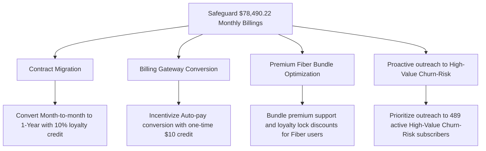

# Executive Briefing: Customer Retention & Churn Risk Audit
**To:** C-Suite Executive Committee  
**From:** Director of Customer Experience & Business Intelligence  
**Date:** 2026-05-21  
**Dataset Reference:** Calibrated Telecom Customer Database (7,043 subscribers)

---

## Executive KPI Scorecard
Below is the dynamic baseline of our customer portfolio. These metrics constitute the core indicators of brand stability, revenue leakage, and active financial exposure:

| Indicator | Metric Value | Business Commentary |
| :--- | :--- | :--- |
| **Total Customer Pool** | `7,043` subscribers | Total portfolio baseline analyzed. |
| **Active Subscriber Base** | `4,929` subscribers | Retained customer cohort generating current monthly billings. |
| **Portfolio Churn Rate** | `30.02%` | Core attrition rate (industry baseline: 20-30%). |
| **Monthly Revenue Leakage** | `$149,048.46 / mo` | Direct monthly billing losses from churned subscribers. |
| **Cumulative Revenue Loss** | `$2,620,559.04` | Lifetime financial impact of customer attrition. |
| **High-Risk Active Portfolio** | `1,040` subscribers | Currently active subscribers classified as high churn risk. |
| **High-Risk Revenue Exposure** | `$78,490.22 / mo` | Active billings at immediate risk of attrition (`28.24%` of total active portfolio). |

---

## 1. Attrition Diagnostic: Root Causes of Revenue Leakage

Our exploratory data and correlation analysis successfully isolated three major systemic pain points driving customer attrition:

1. **Flexibility Over Loyalty (Contract Type):** 
   - **Month-to-month contracts** are responsible for the vast majority of customer loss, exhibiting an aggressive churn rate of `46.8%`.
   - By comparison, customers locked into 1-year and 2-year contracts show churn rates of only `12.0%` and `6.6%` respectively.
   
2. **Pricing and Infrastructure Friction (Fiber Optic Users):**
   - Subscribers using **Fiber Optic Internet** show a churn rate of `44.5%` (with average monthly bills of `$97.34`). 
   - While Fiber Optic offers premium speeds, the aggressive monthly billing acts as a primary stressor. This indicates pricing dissatisfaction or service/support bottlenecks on fiber-optic nodes.
   
3. **Manual Billing Gateway Friction (Electronic Check):**
   - Customers utilizing **Electronic Check** as their payment gateway churn at `35.3%`, compared to auto-paying subscribers (credit cards or bank transfers) who churn at only `28.2%` on average. 
   - Every manual check cycle introduces a decision point where customers reconsider their subscription.

---

## 2. Retention Strategy Roadmap (4-Point Playbook)

To safeguard the **$78,490.22/mo** in exposed monthly billings, we propose a targeted customer-retention campaign prioritizing our active high-risk subscribers:

1. **Contract Migration Campaign:**
   - Launch a targeted initiative offering a **10% monthly billing discount** for 12 months to Month-to-month subscribers who migrate to a 1-year agreement. A 10% discount on monthly bills is highly cost-effective compared to the cost of customer acquisition (CAC).
2. **Billing Auto-Pay Conversion Incentive:**
   - Provide a **one-time $10 account credit** for Electronic Check customers who register a credit card or bank account for automated billing. Converting just 30% of these users significantly reduces manual churn decision cycles.
3. **Fiber Optic Value Bundling:**
   - Mitigate fiber pricing dissatisfaction by bundling free value-added services (e.g. streaming services or premium device insurance) for high-value subscribers, anchoring them to the brand.
4. **Direct Retention Outreach to High-Value Churn-Risks:**
   - Task the customer success teams with direct, high-touch outreach to the **489 active "High-Value Churn-Risk" personas** who represent our most critical revenue exposure.

---
*Report generated programmatically via Customer Analytics Pipeline.*
