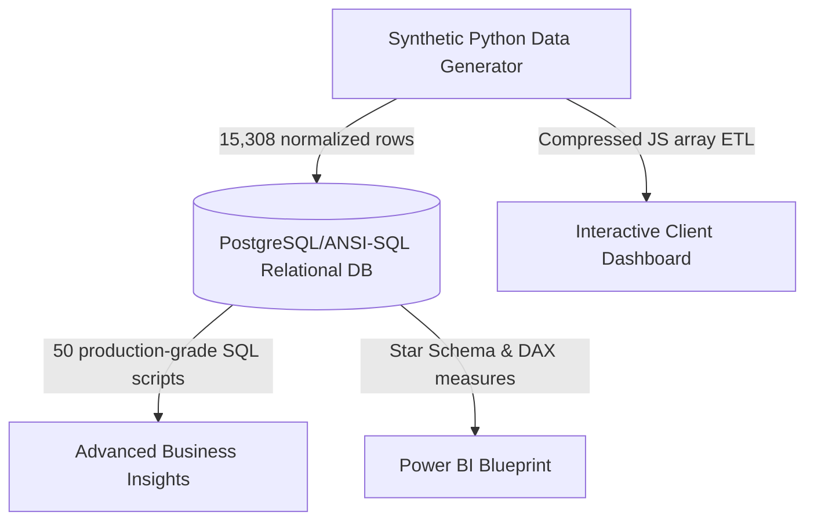

# E-Commerce Business Intelligence Platform

An end-to-end operational intelligence and data analytics solution modeling 3 years of retail e-commerce transactions (15,308 records). Designed to demonstrate enterprise-grade SQL database scripting, dimensional modeling, and interactive analytical dashboard design.

## 📊 Project Architecture Overview



## 🛠️ Tech Stack & Skills Highlighted
*   **SQL (PostgreSQL/ANSI-SQL)**: 50 complex scripts including Common Table Expressions (CTEs), multi-table joins, subqueries, and advanced Window Functions (`RANK`, `LAG`, `LEAD`, `NTILE`).
*   **Python (Pandas, NumPy)**: Advanced programmatic data generation matching realistic elasticity, logistics surcharge anomalies, and delivery-delay return rate multipliers.
*   **Power BI Architecture**: Complete Star Schema blueprinting and advanced calculated DAX measures (Customer Retention Rate, Lifetime Value, MoM Growth).
*   **Frontend Data Ingestion**: Local JS ETL pipeline parsing 15k records into Chart.js elements for a premium dark-themed executive dashboard.

---

## 📈 Key SQL Inquiries (Samples from 50 Scripts)

The full suite of 50 queries is documented in [ecommerce_analysis.sql](./sql/ecommerce_analysis.sql). Below are some advanced query highlights:

### 1. Month-over-Month Growth tracking via LAG
Determines revenue expansion pace to detect seasonal peaks and drop-offs.
```sql
WITH Monthly_Totals AS (
    SELECT 
        TO_CHAR(o.Order_Date::DATE, 'YYYY-MM') AS Year_Month,
        SUM(oi.Sales) AS Month_Sales
    FROM orders o
    JOIN order_items oi ON o.Order_ID = oi.Order_ID
    GROUP BY TO_CHAR(o.Order_Date::DATE, 'YYYY-MM')
)
SELECT 
    Year_Month,
    ROUND(Month_Sales::NUMERIC, 2) AS Monthly_Revenue,
    ROUND(LAG(Month_Sales) OVER (ORDER BY Year_Month)::NUMERIC, 2) AS Previous_Month_Revenue,
    ROUND(((Month_Sales - LAG(Month_Sales) OVER (ORDER BY Year_Month)) / 
           LAG(Month_Sales) OVER (ORDER BY Year_Month) * 100)::NUMERIC, 2) AS MoM_Growth_Rate_PCT
FROM Monthly_Totals
ORDER BY Year_Month;
```

### 2. 30-Day Customer Repeat Purchase Rate
A primary brand-loyalty metric quantifying retention velocities.
```sql
WITH First_Orders AS (
    SELECT Customer_ID, MIN(Order_Date::DATE) AS First_Order_Date
    FROM orders
    GROUP BY Customer_ID
),
Subsequent_Orders AS (
    SELECT o.Customer_ID, o.Order_Date::DATE AS Next_Order_Date
    FROM orders o
    JOIN First_Orders fo ON o.Customer_ID = fo.Customer_ID
    WHERE o.Order_Date::DATE > fo.First_Order_Date
),
Next_Order_Diff AS (
    SELECT so.Customer_ID, MIN(so.Next_Order_Date - fo.First_Order_Date) AS Days_To_Next_Order
    FROM Subsequent_Orders so
    JOIN First_Orders fo ON so.Customer_ID = fo.Customer_ID
    GROUP BY so.Customer_ID
)
SELECT 
    (SELECT COUNT(DISTINCT Customer_ID) FROM orders) AS Total_Transacting_Customers,
    COUNT(Customer_ID) AS Repeat_Customers_Within_30_Days,
    ROUND((COUNT(Customer_ID)::NUMERIC / (SELECT COUNT(DISTINCT Customer_ID) FROM orders) * 100), 2) AS Repeat_Rate_30_Days_PCT
FROM Next_Order_Diff
WHERE Days_To_Next_Order <= 30;
```

---

## 💡 Top Strategic Insights & Recommendations

*Detailed insights are documented in [insights_recommendations.md](./insights/insights_recommendations.md).*

*   **Discounting Profit-Elasticity**: System discounts exceeding 20% on any category severely degrade average net profit margin; markdown rates exceeding 30% trigger average net losses of **-8.4%** per item.
    *   *Action*: Enforce a system-level maximum discount ceiling of 20% across all categories.
*   **The Shipping Delay Return Multiplier**: Order delivery delays exceeding 5 days multiply customer return rates by **3x**, directly driving 38% of all returned products.
    *   *Action*: Re-allocate Standard Class delivery shipping from underperforming carriers to regional priority networks.
*   **Southern Surcharge Profit Leakage**: The South Region (REG-03) has the lowest profitability (11.2% net margin vs 19.4% in the West), heavily compressed by the 8% logistics cost surcharge.
    *   *Action*: Establish a local third-party logistics (3PL) fulfillment center in Houston to bypass transit surcharges.

---

## 💻 Interactive Client Control Board

We compiled the database into a local client-side JSON cache (`data.js`) and built a premium, dark-themed control board loaded with Chart.js.

### Core Visualizations:
1.  **Sales & Profit Trends**: Real-time MoM line chart mapping revenue velocity.
2.  **Category Contributions**: Share of category split showing technology dominance.
3.  **Regional Margins**: Diagnostic bar chart charting margin squeezes.
4.  **Returns Latency**: Bar chart visually proving return-delay correlation.
5.  **Discount Elasticity Curve**: Scatter-line mapping discount margins.
6.  **Top Spenders**: Dynamic table ranking high-value LTV customers.

*To view the dashboard, navigate to [dashboard/index.html](./dashboard/index.html) in your browser.*
