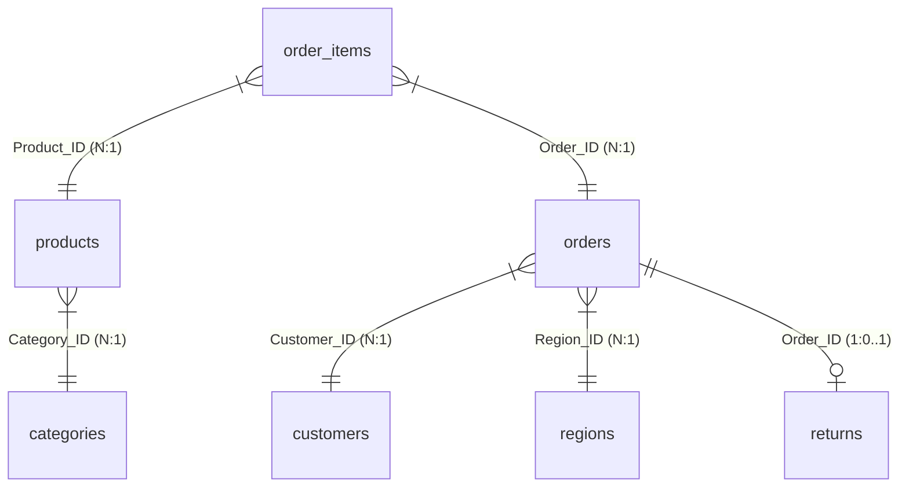

# Power BI Design Guide: E-Commerce BI Platform

This document describes the architectural blueprints, relational Star Schema, custom DAX metrics, and dashboard design guidelines required to build the **E-Commerce Business Intelligence Platform** in Power BI.

---

## 1. Relational Star Schema Model

To ensure optimal performance and standard data warehouse practices, the database is structured into a **Star Schema** with one fact table and six supporting dimension tables.



### Table Relationships Mapping

| From (Fact/Dimension) | To (Dimension) | Keys Used | Cardinality | Cross Filter Direction |
| :--- | :--- | :--- | :--- | :--- |
| `order_items` | `products` | `Product_ID` | Many to One (`*:1`) | Single |
| `order_items` | `orders` | `Order_ID` | Many to One (`*:1`) | Single |
| `orders` | `customers` | `Customer_ID` | Many to One (`*:1`) | Single |
| `orders` | `regions` | `Region_ID` | Many to One (`*:1`) | Single |
| `products` | `categories` | `Category_ID` | Many to One (`*:1`) | Single |
| `orders` | `returns` | `Order_ID` | One to One/Optional (`1:0..1`) | Both |

---

## 2. Calculated DAX Measures (Enterprise-Grade)

Create a blank table named `_Measures` and implement the following DAX calculations:

### 1. Lifetime Value (LTV)
*Calculates the lifetime cumulative revenue generated per customer.*
```dax
Customer_LTV = 
CALCULATE(
    SUM(order_items[Sales]),
    ALLEXCEPT(customers, customers[Customer_ID])
)
```

### 2. Month-over-Month (MoM) Sales Growth
*Measures sales change percentage compared to the previous calendar month.*
```dax
Sales_MoM_Growth = 
VAR CurrentMonthSales = SUM(order_items[Sales])
VAR PreviousMonthSales = 
    CALCULATE(
        SUM(order_items[Sales]),
        DATEADD('orders'[Order_Date], -1, MONTH)
    )
RETURN
    IF(
        ISBLANK(PreviousMonthSales),
        BLANK(),
        DIVIDE(CurrentMonthSales - PreviousMonthSales, PreviousMonthSales)
    )
```

### 3. Customer Retention Rate (CRR)
*Measures the proportion of customers returning for subsequent transactions in a month.*
```dax
Retention_Rate = 
VAR ActiveCustomersCurrentMonth = 
    DISTINCTCOUNT(orders[Customer_ID])
VAR ActiveCustomersPreviousMonth = 
    CALCULATE(
        DISTINCTCOUNT(orders[Customer_ID]),
        DATEADD('orders'[Order_Date], -1, MONTH)
    )
VAR RetainedCustomers = 
    CALCULATE(
        DISTINCTCOUNT(orders[Customer_ID]),
        FILTER(
            VALUES(orders[Customer_ID]),
            CALCULATE(COUNTROWS(orders), DATEADD('orders'[Order_Date], -1, MONTH)) > 0
        )
    )
RETURN
    DIVIDE(RetainedCustomers, ActiveCustomersPreviousMonth, 0)
```

### 4. Repeat Purchase Rate (RPR)
*Measures the percentage of customers with more than one lifetime order.*
```dax
Repeat_Purchase_Rate = 
VAR CustomerOrders = 
    SUMMARIZE(
        orders,
        orders[Customer_ID],
        "OrderCount", COUNT(orders[Order_ID])
    )
VAR RepeatCustomers = 
    COUNTROWS(
        FILTER(CustomerOrders, [OrderCount] > 1)
    )
VAR TotalCustomers = 
    COUNTROWS(CustomerOrders)
RETURN
    DIVIDE(RepeatCustomers, TotalCustomers, 0)
```

---

## 3. UI/UX Style & Design Tokens

To match the premium, modern visual look of high-end analytical dashboards, use the following design system parameters:

### Harmonic Dark Theme Palette
*   **Background**: Deep Charcoal/Obsidian (`#0D0F12`)
*   **Card Container Background**: Translucent Graphite (`#1A1F26`) with 2px borders
*   **Border Color**: Cool Slate/Steel Blue (`#2B3543`)
*   **Primary Accent**: Neon Cyan/Teal (`#00F2FE` - highlights key numbers and trend lines)
*   **Secondary Accent**: Bright Purple/Indigo (`#8A2BE2` - category/segment splits)
*   **Success Metric**: Emerald Green (`#00E676` - positive profit indicators)
*   **Risk Metric / Alert**: Crimson Red (`#FF1744` - returned orders, losses)
*   **Text/Data Labels**: Ice White (`#F5F7FA`) and Silver Gray (`#A0AEC0`)

### Typography
*   **Font Family**: `Segoe UI` or `Segoe UI Semibold` (standard inside Power BI)
*   **KPI Titles**: 11pt, Medium, Color `#A0AEC0`
*   **KPI Value Callouts**: 28pt, Bold, Color `#F5F7FA`
*   **Axis/Legend Labels**: 9pt, Regular, Color `#A0AEC0`

### Visual Structure & Layout Grid
*   **Header Banner**: Slim, anchored at the top, dark gray background with logo, dashboard title, and quick-filter toggle.
*   **KPI Strip**: 4-card horizontal row at the top displaying Revenue, Profit Margin %, Transaction Volume, and Return Rate %.
*   **Column 1 (Trend line)**: Monthly Revenue & Profit YoY Trend Line (interactive).
*   **Column 2 (Bar Chart)**: Subcategory Profit Margin comparison highlighting negative performers.
*   **Column 3 (Map/Matrix)**: Regional Sales breakdown highlighting discount-profit correlation.
