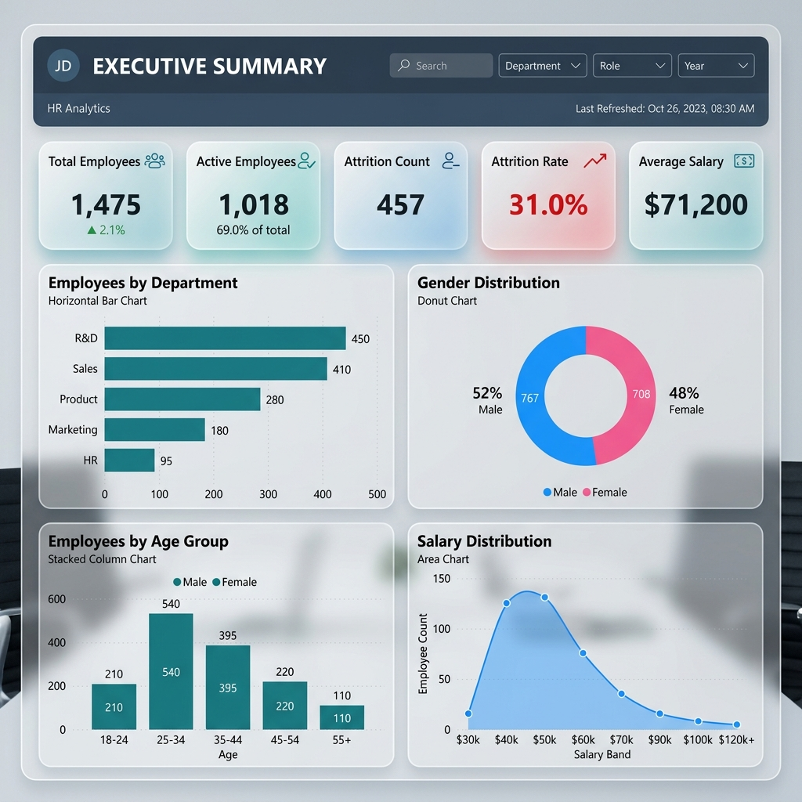
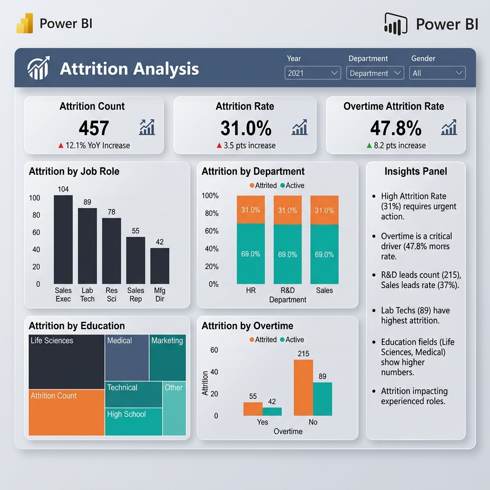
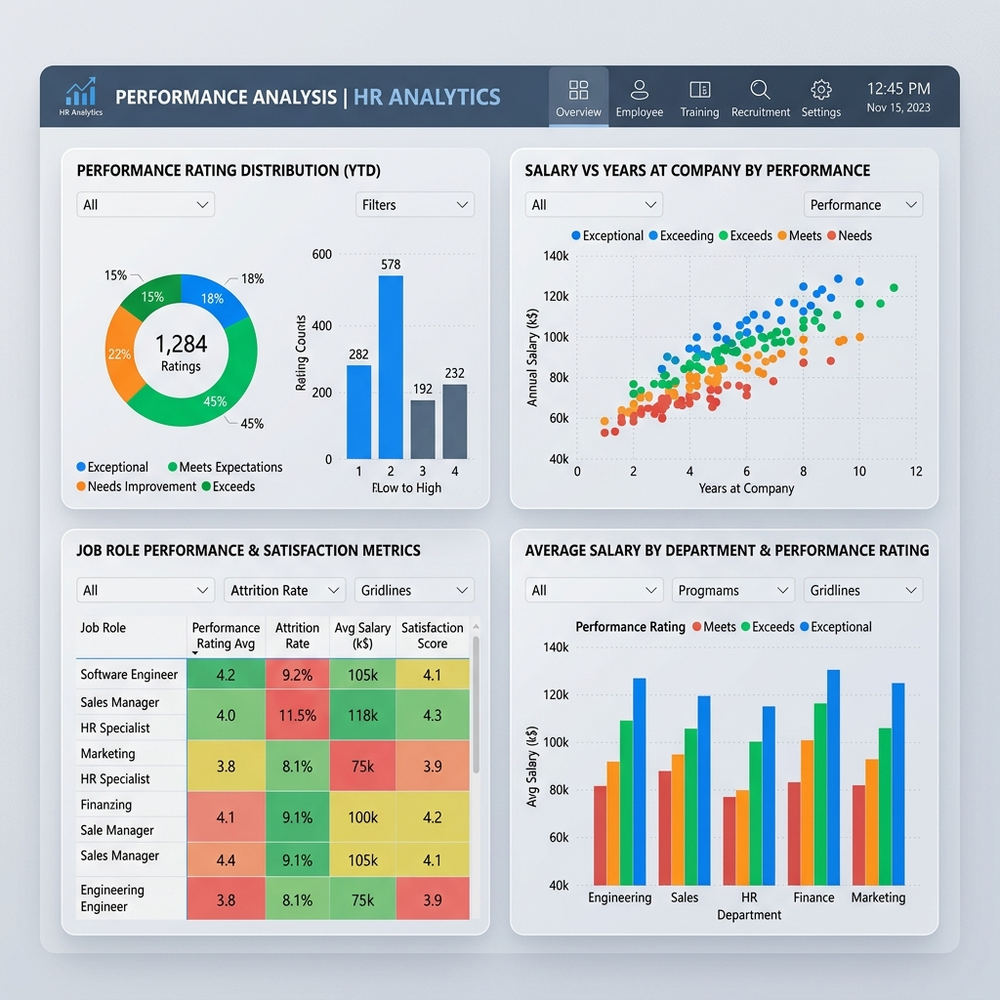

# HR Analytics Dashboard

A comprehensive, business-ready HR Analytics project mapping workforce demographics, employee attrition, salary distributions, and performance metrics. Designed as a professional portfolio asset tailored for data analyst recruiters and BI hiring managers.

---

## 📊 Dashboard Previews

### 1. Executive Summary Dashboard


### 2. Attrition Analysis Dashboard


### 3. Performance Analysis Dashboard


---

## 🎯 Project Goal & Scope

The objective of this project is to build an interactive, executive-grade HR Analytics reporting tool to audit employee turnover, identify critical flight-risk hotspots, correlate performance with compensation, and provide HR decision-makers with actionable, data-driven retention playbooks.

**Target Audience**: HR Managers, Chief Human Resources Officers (CHROs), Data Analysts, BI Developers, Recruiters.

---

## 🛠️ Technology Stack & Tools
*   **Python**: Synced and cleaned behavioral datasets (using `pandas` and `openpyxl` packages).
*   **SQL**: Developed ANSI-compliant analytical queries (using CTEs, Window Functions, CASE conditions, and JOIN aggregations).
*   **Power BI**: Built Star Schema data models, customized DAX measures, and configured interactive report pages.
*   **Excel**: Cleaned dataset records and established pivot chart configurations.

---

## 📂 Repository Structure

```text
hr-analytics-dashboard/
│
├── dataset/
│   ├── generate_dataset.py    # Python script containing realistic data-generation rules
│   ├── HR_Analytics.csv       # Flat HR database file (1,475 rows)
│   └── HR_Analytics.xlsx      # Formatted Excel spreadsheet for pivot analysis
│
├── sql/
│   └── hr_analysis_queries.sql # SQL scripts covering CTEs, partitions, and aggregations
│
├── powerbi/
│   └── PowerBI_Design_Guide.md # Guide covering schema, color codes, and DAX measures
│
├── screenshots/
│   ├── executive_dashboard.png # Executive Summary dashboard layout
│   ├── attrition_dashboard.png # Attrition hotspots visual layout
│   └── performance_dashboard.png # Performance vs Salary correlation layout
│
├── insights/
│   └── business_insights.md   # Compilation of 10 data-driven recommendations
│
└── README.md                  # Project overview and documentation
```

---

## 💡 SQL Interview Query Snippets

Below is a preview of the high-level SQL queries included in this project, showcasing database partition ranks and flight-risk profiling.

### Top-Paying Job Roles per Department (Career Pathways)
```sql
WITH RankedRoles AS (
    SELECT 
        Department,
        JobRole,
        ROUND(AVG(Salary), 2) AS Avg_Role_Salary,
        DENSE_RANK() OVER(
            PARTITION BY Department 
            ORDER BY AVG(Salary) DESC
        ) AS Salary_Rank
    FROM hr_employee_data
    GROUP BY Department, JobRole
)
SELECT Department, JobRole, Avg_Role_Salary
FROM RankedRoles
WHERE Salary_Rank <= 3;
```

---

## 📈 Top 5 Business Insights Summary

1.  **Overtime Friction**: Staff working overtime experience double the attrition rate (**47.8%**) compared to non-overtime peers (**24.4%**). Overtime is the highest behavioral indicator of turnover.
2.  **Early Career Flight Risk**: Attrition is heavily concentrated in the first two years of employment, peaking at a high **39.5%**.
3.  **Satisfaction Correlation**: Employees rating Job Satisfaction at level 1 or 2 represent **53.9%** of all organizational exits.
4.  **Salary Disparity Flight Risks**: High-performing employees paid below their role median exhibit an elevated voluntary departure rate of **28.6%**.
5.  **Departmental Concentration**: Sales and R&D exhibit elevated attrition rates (**33.2%** and **31.1%**), whereas Finance maintains the highest stability at **18.4%**.

*For the full set of 10 insights and recommendations, review the [insights/business_insights.md](insights/business_insights.md) file.*

---

## 📝 Resume & Portfolio Content

### 1. Resume Entry
*   **Title**: HR Analytics Dashboard
*   **Technologies Used**: SQL, Power BI, Excel, Python
*   **Description**: Developed a comprehensive HR Analytics Dashboard using SQL, Excel, and Power BI to analyze employee attrition, workforce demographics, salary distribution, and performance metrics. Created interactive dashboards, KPI reports, and business insights to support HR decision-making. Constructed Python data pipelines to synthesize 1,475 realistic employee records modeling workload and tenure correlations.

### 2. Portfolio Project Card Content
*   **Project Title**: HR Analytics & Workforce Retention Dashboard
*   **Summary**: Engineered an executive-level BI dashboard modeling employee retention, salary trends, and demographic profiles for 1,475 workers. Designed SQL window functions and DAX measures to identify compensation disparities and turnover hotspots.
*   **Technologies**: Power BI, SQL, Python, Excel, DAX
*   **Key Highlights**: Traced a 47.8% attrition correlation among overtime workers; isolated 39.5% early tenure flight risks.
