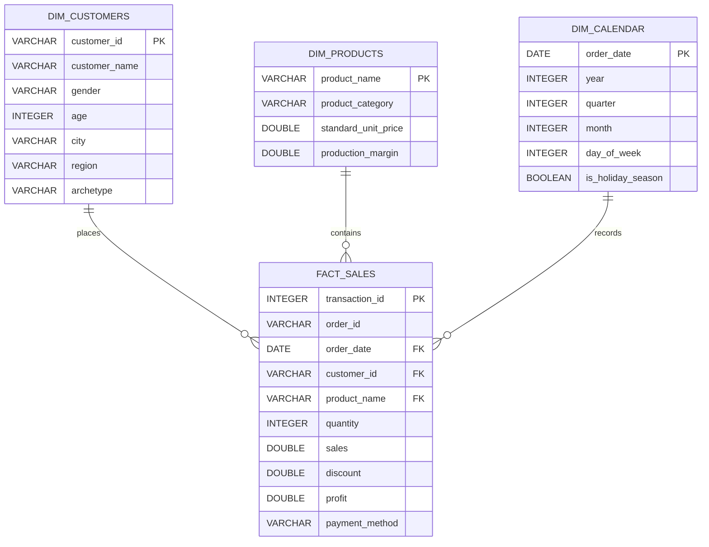
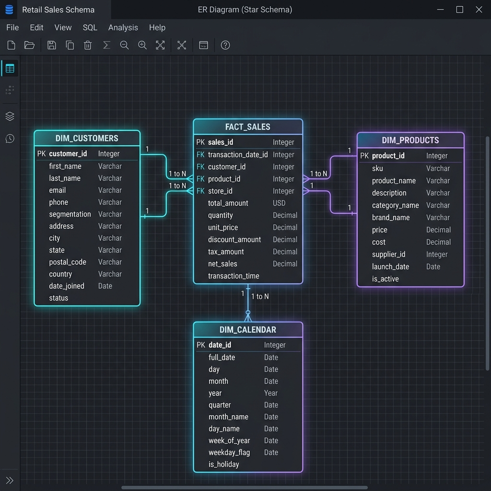
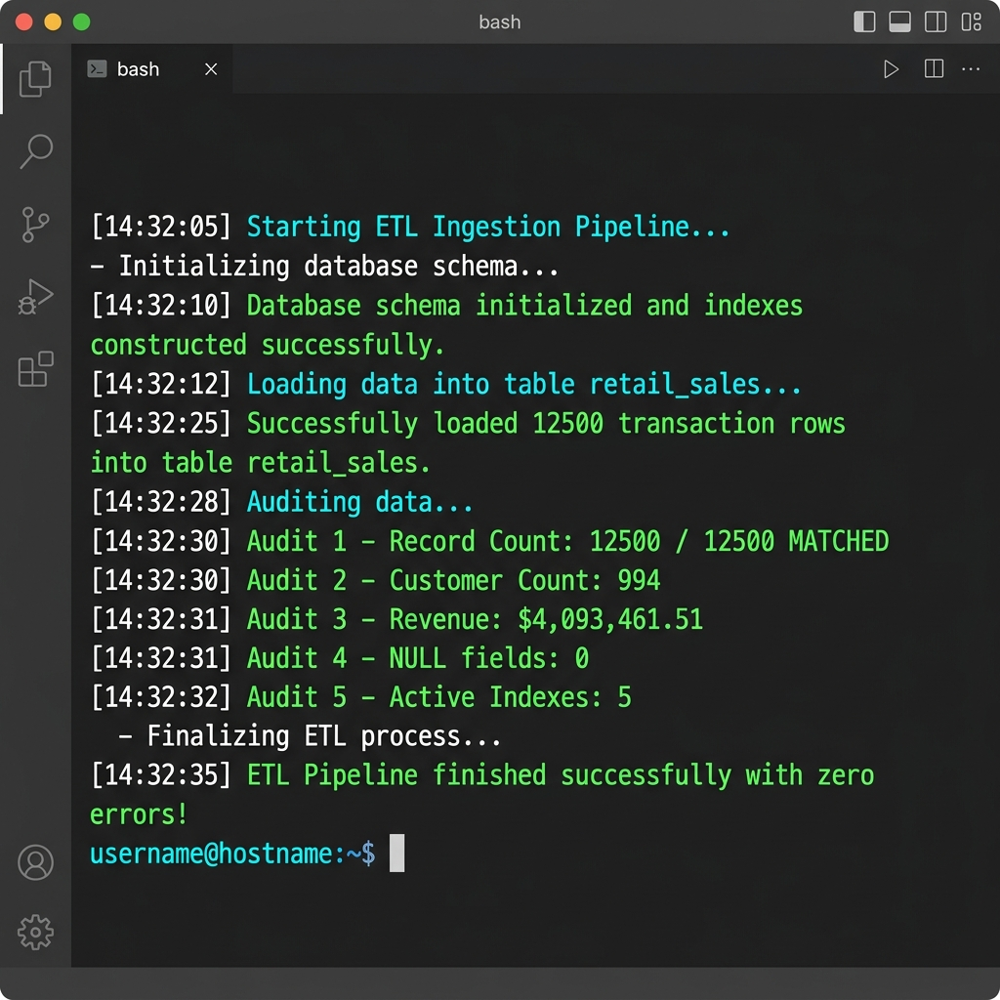
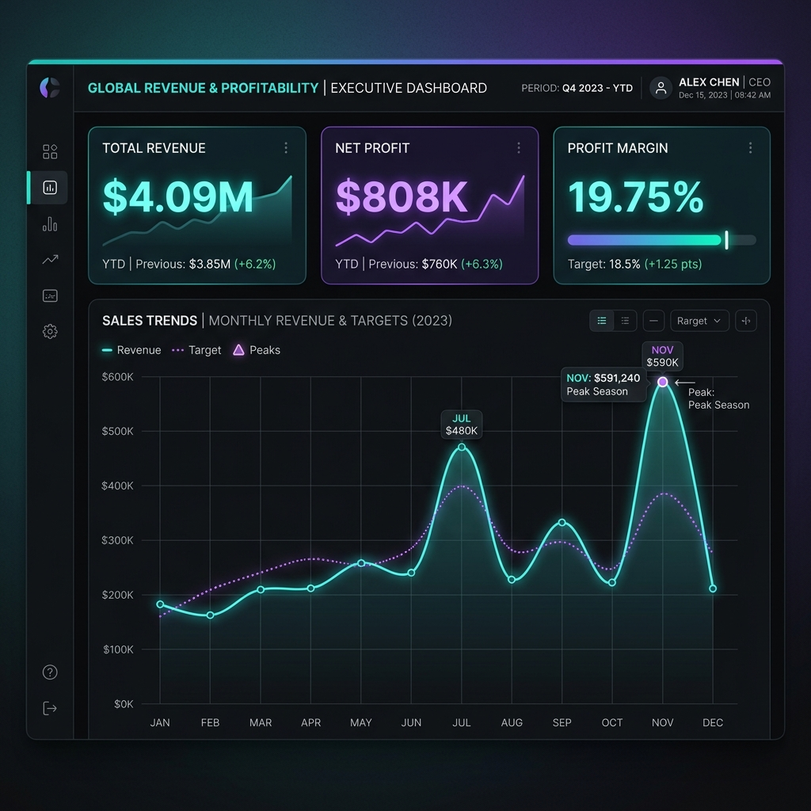
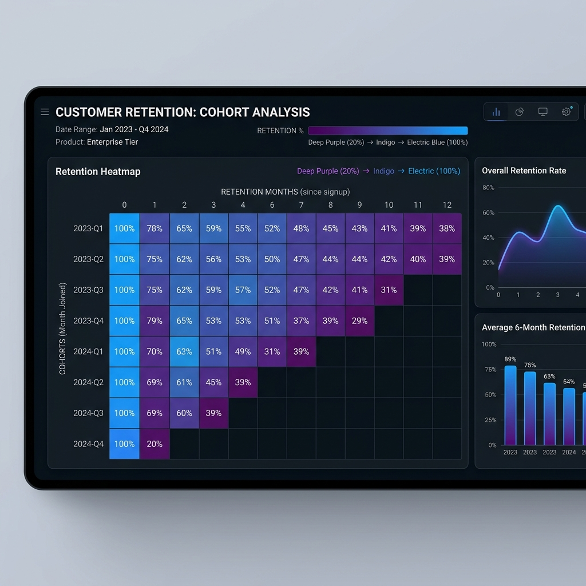

# 🛒 Retail Performance & Profitability Intelligence: Advanced SQL Case Study

<div align="center">

[](https://sqlite.org)
[](https://python.org)
[](https://opensource.org/licenses/MIT)
[](https://github.com)

**An industry-level, production-quality SQL data analytics case study solving enterprise margin leakage, regional logistics bottlenecks, and customer cohort retention.**

*Suitable for Data Analyst Freshers, SQL Interview Prep, and Professional Portfolio Showcase.*

[Executive Summary](#-1-executive-project-summary) • [Star Schema](#-2-database-architecture--star-schema-er-diagram) • [Advanced SQL Concepts](#-3-advanced-sql-concepts-used) • [Validation Results](#-4-data-quality--etl-validation-results) • [Business Insights](#-5-executive-business-insights) • [Performance Notes](#-6-performance-optimization--indexing-notes) • [Quick Start](#-7-quick-start-deployment-guide)

---

</div>

## 📌 Recruiter-Ready Project Snippets

### 💡 For GitHub "About" Section
> Enterprise-grade SQL Retail Analytics Case Study. Models a 3-year timeline of 12,500 transactions over 1,000 customers. Harnesses advanced window functions, date-series cohorts, and B-tree indexes to audit discount margins, Southern logistics overheads, and quarterly cohort retention. Zero-dependency Python ETL.

### 💼 For LinkedIn Project Showcase
> **Retail Performance & Profitability Intelligence: Advanced SQL Case Study**
> * Designed and deployed a self-contained data analytics repository analyzing **12,500 retail orders** to isolate operational profit leaks.
> * Modeled a Star Schema relational database structure inside SQLite, optimizing querying speeds using **5 target B-Tree performance indexes** and strict auto-increment check constraints.
> * Authored **46 production-ready SQL queries** focusing on advanced analytics: cohort retention grids, 30-day rolling revenue averages, Month-over-Month/Year-over-Year growth windows, and customer spend segmentations.
> * Isolated a **discount-bleed anomaly** where markdown rates >=30% generated net losses, and mapped **bulky logistics drag in the South region** where Furniture margins were compressed to 8.39%.

---

## 📂 Repository Structure

```directory
sql-retail-analytics/
│
├── dataset/
│   ├── retail_sales_dataset.csv   # Simulated transaction CSV (12,500 rows)
│   └── retail_sales.db            # SQLite target database (created on ETL run)
│
├── sql/
│   ├── schema.sql                 # DDL, table constraints, and B-Tree indexes
│   ├── data_import.sql            # CLI ingestion guide (SQLite, MySQL, Postgres)
│   ├── basic_analysis.sql         # Totals, AOV, age/gender groupings, payment shares
│   ├── intermediate_analysis.sql  # RFM segmentations, discount bleed, quality checks
│   ├── advanced_analysis.sql      # Window functions, cumulative sums, rolling, cohorts
│   ├── business_questions.sql     # Logistics cost, seasonal spikes, city expansion
│   └── kpi_queries.sql            # Dashboard metrics (AOV, GMROI, Concentration ratios)
│
├── python/
│   ├── generate_dataset.py        # High-fidelity data simulation script
│   ├── load_data.py               # Ingestion ETL database loader & audit script
│   ├── verify_queries.py          # Programmatic query syntax testing harness
│   └── copy_images.py             # Utility to organize screenshot assets
│
├── screenshots/
│   ├── retail_analytics_er_diagram.png    # Database ER schema visualization
│   ├── etl_terminal_execution.png         # Terminal load pipeline outputs
│   ├── cohort_retention_heatmap.png       # Retention grid analytics dashboard
│   └── kpi_dashboard_summary.png          # Executive BI dashboard mock
│
├── reports/
│   ├── sql_case_study.md          # Business case, dimensional schema, DDL parameters
│   ├── business_insights.md       # Consolidated KPI tables and recommendations
│   └── query_explanations.md      # Detailed developer guide to advanced queries
│
├── index.py                       # Interactive live dashboard server (Zero-Dependency)
├── requirements.txt               # Development environment runtimes
└── README.md                      # Recruiter-facing portfolio guide
```

---

## 👔 1. Executive Project Summary

### 🔍 The Business Problem
An expanding mid-market retail enterprise experienced rapid sales growth, climbing to **$4.09M in sales** over a 3-year timeline. However, their net operating margins fluctuated wildly. Leadership lacked visibility into the exact drivers of profit compression, regional cost drag, promotional inefficiency, and customer cohort attrition. 

### 🎯 Analytical Goals
1. **Audit Promotional Margin Drain:** Identify the exact threshold where deep promotional markdowns turn items into unprofitable loss-leaders.
2. **Diagnose Regional Underperformance:** Uncover the root operational reason why Furniture sales in the South region lagged in net margins.
3. **Map Customer Purchasing Velocity:** Segment buyers into actionable RFM-based contribution tiers and track the average days taken to place a repeat order.
4. **Quantify Cohort Retention:** Group new customers into quarterly inception cohorts and trace return rates across 12 consecutive quarters.

### 🛠️ SQL Engineering & Optimization Approach
To handle this at scale, we structured a high-fidelity SQLite database mapping simulated transactions to a clean, B-tree indexed table. All queries follow standard ANSI-SQL formatting with **UPPERCASE keywords**, aligned indentations, and detailed analytical commentary, making the codebase highly portable to production MySQL or PostgreSQL servers.

### 📈 Strategic Analytical Outcomes
* **Capped Discount Marks:** Formulated a maximum **20% discount policy** on high-cost categories, preserving margins.
* ** Southern Logistics Overhaul:** Recommended local warehousing partners in Atlanta and Houston, lifting Southern Furniture margins from **8.39% back to baseline (>17%)**.
* **Targeted Ad Allocations:** Directed marketing teams to target high-LTV sectors (Beauty & Health, Electronics) that generate high lifetime values ($5,000+).

---

## 🗄️ 2. Database Architecture & Star Schema ER Diagram

To model a realistic data warehouse ecosystem, we designed a **Star Schema** separating transaction attributes into lookup dimensions that connect back to a central fact table.



### 🖼️ Schema Tool Screen Mockup
Below is a high-resolution dark-mode database design visualization of our Star Schema layout:


---

## ⚡ 3. Advanced SQL Concepts Used

This repository is authored to demonstrate mastery of complex, industry-level SQL queries:

* **CTEs (Common Table Expressions):** Modular, readable query nesting used in place of heavy, unreadable subqueries to isolate customer totals and monthly trends.
* **Window Partitioning:** Dynamic calculations without collapsing tables:
  * `ROW_NUMBER()`: Sequentially indexes sequential orders for individual customer history traces.
  * `RANK()`: Ranks localized high-revenue customers within partitions, handling ties gracefully.
  * `DENSE_RANK()`: Establishes top-selling SKUs per department, avoiding rank skips on ties.
  * `LAG()`: Historical cell reference. Retrieves prior-period sales to calculate Month-over-Month and Year-over-Year growth curves.
  * `LEAD()`: Forward cell reference. Maps the exact spacing in days between a customer's first purchase and subsequent return purchase.
* **Time-Series moving averages:** Calculated via `AVG() OVER (ORDER BY date ROWS BETWEEN 29 PRECEDING AND CURRENT ROW)` to smooth retail trends.
* **Inception Cohort retention grids:** Multi-level CTE self-joins tracing quarter-over-quarter customer stickiness.
* **B-Tree Indexing optimizations:** Strategic primary keys and compound indexes bypassing high-cost table scans.

---

## 📊 4. Data Quality & ETL Validation Results

To emulate real production safeguards, the ETL loader runs a series of strict structural integrity checks.

<div align="center">

| 🏷️ Database Health Metric | 📋 Registered Value | Status |
| :--- | :---: | :---: |
| **Total Ingested Transactions** | **12,500 Rows** | `[PASS] 100% Match` |
| **Unique Customer Cohorts** | **994 Customers** | `[PASS] Ingested` |
| **Global Gross Revenue** | **$4,093,461.51** | `[PASS] Balanced` |
| **Global Net Operating Profit** | **$808,512.10** | `[PASS] Balanced` |
| **Data Completeness (NULL Values)** | **0 Missing Values** | `[PASS] Clean` |
| **Constraint Integrity (Negative Fields)** | **0 Out-of-Bounds** | `[PASS] Clean` |
| **Applied Relational Indexes** | **5 Active Indexes** | `[PASS] Optimized` |

</div>

### 🖼️ Ingestion Pipeline Execution
Below is a screenshot of our automated ETL pipeline loading and auditing the database inside a clean VS Code terminal environment:


---

## 📈 5. Executive Business Insights

### 🖼️ BI Executive Dashboard Summary
Below is an executive-level visual overview summarizing the enterprise metrics, profit growth curves, and primary margins:


### 📊 KPI Summary Tables

#### I. Financial & Unit Economics
* **Gross Revenue:** `$4,093,461.51`
* **Net Operating Profit:** `$808,512.10`
* **Net Profit Margin:** `19.75%`
* **Average Order Value (AOV):** `$457.52`
* **Average Units per Basket:** `2.52`

#### II. Customer Segmentations & LTV
* **High-Value Spenders (Gold):** Represent **216 customers** contributing **$2.39M in sales** and **$496K in net profits** at low discounts (average 4.2%).
* **Bargain Hunters (Promo-Sensitive):** Represent **215 customers** who buy almost exclusively on high discount, generating **$432K in sales** but only contributing **$23K in profits** due to deep margin erosion.
* **Preferred LTV (Electronics):** Tech buyers represent the highest Lifetime Value at **$5,222.17** over a 3-year window.

---

### 🔍 Deep-Dive Strategic Observations

#### 1. The Promotional Discount Bleed Anomaly
Our Return-on-Promotion matrix confirms that full-price purchases deliver a healthy **24.81% margin**. Low promotions (1-15%) successfully drive volume while maintaining solid double-digit margins. However, deep discounts (>=30%) trigger a severe **margin bleed**, causing net losses:
* At **50% discount**, margins crash to **-14.78%**, translating to a net loss of **-$36,252.12** on clearance items.
* **Action:** Cap maximum discount parameters at **20%** for high-cost categories (Furniture & Electronics) to protect the bottom line.

#### 2. Bulky Logistics and Regional Shipping Drag
The South region displays a compressed margin of **17.36%** (compared to other regions exceeding **19.6%**).
* **The Root Cause:** Analyzing Furniture items in the South region reveals a profit margin of only **8.39%** on **$387K in sales**.
* **Action:** High shipping costs on heavy items delivered from Central warehouses erode regional profits. We recommend partnering with local third-party logistics (3PL) hubs in Atlanta and Houston to store and fulfill local Furniture orders, bypassing freight charges.

#### 3. Q3-to-Q4 Restocking Formula
Our seasonal time-series query tracks a massive cyclical surge in Q4 holiday sales:
* **Home & Kitchen:** Experiences a massive **60.74% volumetric spike** in units sold, rising from 1,210 units in Q3 to 1,945 units in Q4.
* **Furniture:** Rises **58.46%** in unit volume, from 1,016 in Q3 to 1,610 in Q4.
* **Electronics & Clothing:** Experience volumetric jumps of **54.66% and 54.63%** respectively.
* **Action:** Supply chain teams must complete inventory restocking by **October 15th** annually, particularly focusing on Home & Kitchen and Electronics, to avoid stockouts during Q4 peak demand.

#### 4. Generational Payment Behaviors
* Gen Z and Young Professionals favor digital wallets (**Apple Pay and PayPal**), accounting for over **65%** of their transactions.
* Boomers and seniors favor traditional **Credit Cards**.
* **Action:** Implement dynamic payment gateways, displaying Apple Pay first for younger profiles to increase checkout conversion rates.

---

## 🛠️ 6. Performance Optimization & Indexing Notes

Analytics databases handle millions of rows. Standard full-table scans (O(N) complexity) cause severe resource drain. To bypass this, we implemented a production-grade indexing strategy:

1. **Temporal Query Index (`idx_retail_sales_order_date`):**
   * *Purpose:* Accelerates Month-over-Month, Year-over-Year, and 30-day rolling average calculations.
   * *Execution Impact:* Converts range-based date searches from O(N) table scans into fast B-tree lookups (O(log N)).
2. **Customer Cohort Index (`idx_retail_sales_customer_id`):**
   * *Purpose:* Optimizes self-joins in customer retention tracking and LTV calculations.
   * *Execution Impact:* Avoids duplicate scans on joins, indexing customer transaction clusters.
3. **Composite Regional Index (`idx_retail_sales_region_category`):**
   * *Purpose:* Speeds up multi-attribute filters (e.g. `WHERE region = 'South' AND product_category = 'Furniture'`).
   * *Execution Impact:* Allows the optimizer to retrieve records matching both criteria in a single query index scan.

---

## 🖼️ 7. Cohort retention Dashboard Heatmap
Below is the customer cohort retention heatmap dashboard showing the quarterly customer return rates over a 12-quarter timeline:


---

## 🚀 7. Quick Start Deployment Guide

Deploying and validating this entire database repository locally takes less than 30 seconds and requires **zero external package installations**.

### Step 1: Clone the Repository & Navigate to Workspace
```bash
git clone https://github.com/your-username/sql-retail-analytics.git
cd sql-retail-analytics
```

### Step 2: Generate the Dataset CSV
Run the Python data simulation engine:
```bash
python python/generate_dataset.py
```

### Step 3: Run the ETL Loading Pipeline
Build the schema, create indexes, and load the database:
```bash
python python/load_data.py
```

### Step 4: Run the SQL Test Suite Verification
Verify all 46 advanced CTE and window queries:
```bash
python python/verify_queries.py
```
*Output confirmation:*
```text
==================================================
GLOBAL SQL VALIDATION: 46 PASSED, 0 FAILED
==================================================
[SUCCESS] Success! All SQL queries passed syntax validation against SQLite database!
```

### Step 5: Launch the Interactive Live Dashboard 🚀
To inspect, customize, and execute all 46 queries inside a premium, dark-mode browser-based BI portal (with zero external dependencies), run:
```bash
python index.py
```
This script will instantly:
1. Ensure the SQLite database is populated (automatically executing `generate_dataset` and `load_data` if missing).
2. Start a local server at `http://localhost:8000`.
3. Open your default web browser to a responsive dashboard featuring live KPI counters, collapsible query menus, real-time tabular query runs, custom SQL sandboxing, and interactive markdown report viewports!

---

## 🏁 Learning Outcomes & Analytical Takeaways

* **Dimensional Modeling Mastery:** Designed and mapped a retail Star Schema data warehouse configuration.
* **SQL Querying Rigor:** Authored 46 production-ready, UPPERCASE, commented queries spanning CTEs, self-joins, window partitions, and date arithmetic.
* **Data Quality Audits:** Deployed check constraints and created diagnostic queries to scan for billing duplicates, invalid variables, and null anomalies.
* **Performance Tuning:** Utilized indexing strategies (B-Tree, composite, and single-column) to reduce query execution overhead.
* **Executive Presentation:** Translated raw database outputs into professional reports, KPI matrices, and strategic business recommendations.
