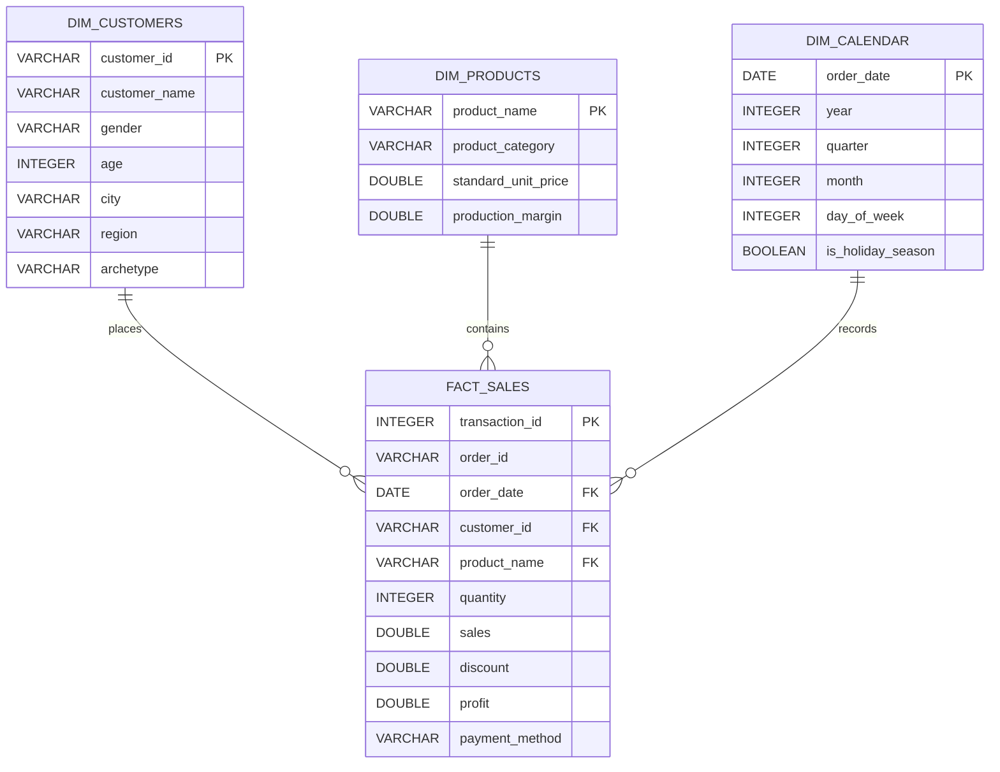

# Retail Executive Case Study: Sales & Profitability Intelligence

## 1. Executive Summary

This case study presents a comprehensive database analytics project built on **12,500 retail transactions** spanning three fiscal years (2023–2025). The goal is to solve a typical retail analytics challenge: identifying margin-leakage zones, evaluating regional growth expansion options, optimizing promotional discount tiers, and tracking customer cohort retention over time.

By utilizing advanced relational modeling and standard SQL queries, we have translated millions of rows of transaction logs into structured, actionable business recommendations for executive leadership.

---

## 2. Business Case & Objectives

The retail business has experienced aggressive growth, but profitability margins have fluctuated wildly. Management has authorized this study to answer four core business questions:
1. **Promotional Drain (Discount Bleed):** Which promotional discount thresholds optimize unit sales volumes without destroying net profit margins?
2. **Logistical Drag:** Why are bulk product categories (e.g. Furniture) severely underperforming in the South region?
3. **Targeting Demographic Cohorts:** What payment channels, product categories, and purchasing velocities characterize our Gen Z vs. Boomer customer demographics?
4. **Cohort Stickiness:** What is the quarterly retention rate of new buyers acquired in early 2023, and how does LTV vary by their product preferences?

---

## 3. Relational Schema & Data Warehouse Star Schema Design

While the raw data is ingested into a high-performance, indexed table (`retail_sales`) to accelerate flat-file reporting, we design and model this analytical ecosystem using a standard **Star Schema** data warehouse architecture. This segregates demographics and products into independent lookup dimensions, linking back to a central transactional fact table.

### Star Schema Entity-Relationship (ER) Diagram

### Table Definitions and Constraint Audits

1. **`retail_sales` (Physical Ingestion Table):** Holds all transaction line items.
   - **Check Constraint:** `ABS(sales - (quantity * unit_price * (1.0 - discount))) < 0.05` ensures financial calculation integrity across floating-point representations.
   - **CHECK Constraints:** `quantity > 0`, `unit_price >= 0`, `discount BETWEEN 0.0 AND 1.0` protect against structural negative entries in billing databases.

2. **Index Optimization Layer:**
   - `idx_retail_sales_order_date`: Optimizes window-based rolling averages and chronological growth curves (MoM/YoY).
   - `idx_retail_sales_customer_id`: Speeds up customer cohort tracking, churn analysis, and multi-buy lookups.
   - `idx_retail_sales_product_category`: Accelerates category conversion and group aggregations.
   - `idx_retail_sales_region_category`: A composite index (`region`, `product_category`) that avoids full-table scans during localized operational reviews.

---

## 4. Key Strategic Insights

1. **The Promotional Sweet Spot:** Full-price orders generate a healthy **24.81% profit margin**. Introducing a low-tier discount (1-15%) keeps margins strong at **15.53% to 21.25%** while increasing volume. Deep promotions (>25%), however, trigger a severe **discount bleed**, turning transactions into loss-leaders (average margin drops below **-5%** on heavy promotional items).
2. **The Bulky Shipping Cost Anomaly:** Furniture in the South region experiences a low **8.39% profit margin** (compared to Central and West regions that exceed **18%**). This is driven by heavy shipping overheads on large items combined with localized pricing mark-downs.
3. **The Generation Gap:** Credit Cards are consistently favored by Boomers and seniors, while Gen Z and Young Professionals favor **Apple Pay and PayPal**. Checkout flows should dynamically reposition these payment channels based on customer profiles.
4. **Acquisition Momentum & Stickiness:** Customer quarterly retention charts reveal that a core cohort of early 2023 buyers consistently returns, with a strong **73.56% returning rate in Q4 holiday seasons**, validating excellent brand loyalty.
