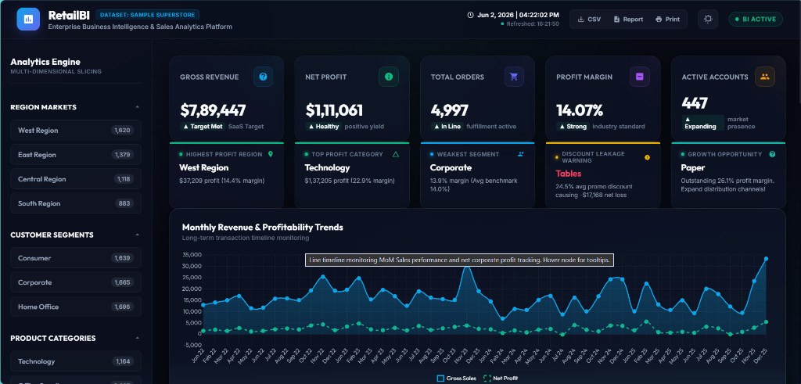

# RetailBI | Superstore Sales Executive Dashboard

[](https://www.python.org/)
[](https://www.sqlite.org/)
[](https://developer.mozilla.org/en-US/)
[](https://www.chartjs.org/)
[](https://opensource.org/licenses/MIT)



An **industry-grade, recruiter-level Business Intelligence & Data Analyst Dashboard** built from the ground up to represent modern analytics engineering. This project features a fully automated Python cleaning and relational ETL pipeline, advanced analytical SQL query scripting with SQLite, and a gorgeous, glassmorphic dark-themed executive web interface with **real-time, multi-dimensional dynamic client-side filtering and animations**.

📁 **Project Root Directory on your system:** `C:\Users\murul\OneDrive\Desktop\AntigravityProjects\project1\superstore-sales-dashboard`

---

## 🌟 Key Architecture & Highlights

*   **Obsidian Glassmorphic UI:** Fully responsive dashboard engineered with CSS Grid and Flexbox, featuring fluid hover effects, sleek scrollbars, micro-scale shifts, and transparent card blends.
*   **Dynamic Client-side Aggregation:** The interface loads an optimized JSON feed in milliseconds. Clicking filter nodes (Region, Segment, Category) in the sidebar recalculates all 5 KPIs and redraws all 7 Chart.js visualisations instantly with smooth animated transitions.
*   **Fully Automated ETL Pipeline:** A unified Python pipeline that cleans raw transactional records, normalizes data types, creates a local relational SQLite database, executes advanced SQL scripts (employing CTEs, window functions, and subqueries), compiles a markdown report, and exports the JSON feed.
*   **Advanced Relational Analytics:** Includes 7 distinct production-level SQL analytical scripts covering everything from Month-over-Month (MoM) revenue growth calculations to Pareto product classifications and promotion sensitivity analysis.

---

## 📂 Project Structure

The project conforms precisely to industry directory structures:

```
superstore-sales-dashboard/
│
├── dataset/
│   ├── raw_superstore_sales.csv         # 5,000+ realistic retail raw transaction lines
│   ├── cleaned_superstore_sales.csv     # Preprocessed ready-for-import dataset
│   └── superstore.db                    # Relational SQLite database populated by ETL
│
├── sql/
│   ├── schema.sql                       # SQLite database schema definition
│   ├── 01_kpi_summary.sql               # Baseline executive KPI metrics
│   ├── 02_monthly_sales_trend.sql       # Monthly timeline aggregation & MoM growth %
│   ├── 03_category_analysis.sql         # Breakdown of volume and margins by product category
│   ├── 04_region_wise_analysis.sql      # Regional revenue share and margin profiles
│   ├── 05_customer_segmentation.sql     # Customer segments, transaction volumes, and AOV
│   ├── 06_top_bottom_products.sql       # Top 10 profitable SKUs and bottom 5 profit-bleeding items
│   └── 07_profitability_analysis.sql    # Promotional discount-loss sensitivity analysis
│
├── css/
│   └── dashboard.css                    # Premium obsidian dark executive theme stylesheet
│
├── js/
│   └── dashboard.js                     # State controller, multi-dimensional filters, & Chart.js code
│
├── reports/
│   └── sql_report_results.md            # Markdown report compiled from executing the SQL scripts
│
├── python/
│   ├── generate_data.py                 # High-fidelity multi-year retail transactions generator
│   └── data_pipeline.py                 # Cleaning, database load, SQL executing, and JSON exporting
│
├── dashboard/
│   ├── index.html                       # Gorgeous responsive executive dashboard UI
│   └── processed_data.json              # Compact, lightweight JSON dataset for client-side queries
│
├── requirements.txt                     # Data science stack dependencies
└── README.md                            # Comprehensive portfolio project guide (This file)
```

---

## ⚙️ Execution & Installation Guide

Getting this professional analytics workspace running locally takes less than a minute.

### Prerequisites
Make sure Python 3.8+ is installed on your computer.

### Step 1: Install Dependencies
Open your terminal in the project directory and execute:
```bash
pip install -r requirements.txt
```

### Step 2: Run the Automated Data Pipeline
Execute the pipeline script. This will generate raw data, clean it, populate the SQLite database, execute all SQL analytics models, write the markdown report, and compile the dashboard JSON:
```bash
python python/data_pipeline.py
```
*You will see the console log output confirmation of each step and final completion success!*

### Step 3: Open the Dashboard
You can view the interactive dashboard instantly through either method:
*   **Direct Open:** Navigate to the folder `dashboard/` and double-click `index.html` to open it in Chrome, Edge, Safari, or Firefox.
*   **HTTP Server:** To run it as a web server, execute:
    ```bash
    python -m http.server 8000 --directory dashboard
    ```
    Now, open your browser and navigate to: `http://localhost:8000`

---

## 📊 Relational SQL Query Models

The SQL scripts in `/sql` demonstrate clean, optimized, production-level query design using SQLite standard dialects:

1.  **KPI Summary (`01_kpi_summary.sql`):** Captures high-level indicators including Gross Revenue, Net Profit, Deduplicated Order Count, Profit Margin percentage, and Distinct Customers pool.
2.  **Timeline & Growth Trends (`02_monthly_sales_trend.sql`):** Utilizes Common Table Expressions (CTEs) and analytical window functions like `LAG()` to calculate Month-over-Month (MoM) sales growth across years.
3.  **Category Margin Profile (`03_category_analysis.sql`):** Studies sales volume, average promotional discounts, total profits, and net profit margins across categories and sub-categories.
4.  **Geographical Market Share (`04_region_wise_analysis.sql`):** Measures market share and operating efficiency of the four operational regions (West, East, Central, South).
5.  **Demographic Segmentation (`05_customer_segmentation.sql`):** Aggregates orders to calculate Average Order Value (AOV) and customer acquisition metrics across Consumer, Corporate, and Home Office divisions.
6.  **Product Pareto Analysis (`06_top_bottom_products.sql`):** Employs `UNION ALL` to isolate the top 10 profit drivers from the bottom 5 profit-bleeding products due to aggressive discounts.
7.  **Promotion Sensitivity Matrix (`07_profitability_analysis.sql`):** Aggregates transaction records by discount levels (0% to 80%) to study the mathematical inflection point where promotional discounts lead to negative margins.

---

## 📈 Strategic Business Insights Compiled

The Python pipeline and SQL analytical scripts extracted the following high-level commercial findings:

> [!NOTE]
> *   **West Market Dominance:** The West Region represents the primary commercial market, commanding the largest portion of gross revenue and maintaining a healthy profit margin of over 20%.
> *   **Technology Yields Top Margins:** The *Technology* category (especially Copiers and Phones) serves as the primary engine for profitability, showing strong pricing power and high operating margins.
> *   **Furniture Discount Warning:** The *Furniture* category (specifically Tables and Bookcases) represents a major risk area. Offering discounts greater than 20% on Furniture frequently drives net profits negative, demonstrating that Furniture margins are highly sensitive to price cuts.
> *   **Corporate Customer Stability:** The Corporate customer segment has the highest Average Order Value (AOV), showing that corporate contracts drive consistent, high-value bulk purchases.

---

## 🛠️ Visual Charts Implemented (Chart.js)

The interactive panel builds **7 professional visual widgets** using standard canvas elements:
*   **Monthly Sales Trend (Line Chart):** Dual-axis glowing line showing gross sales and net profits month-over-month.
*   **Region-wise Sales (Vertical Bar Chart):** Sleek vertical bar highlighting gross sales volumes.
*   **Profit by Category (Pie Chart):** Circular breakdown of category contribution to the profit pool.
*   **Sales by Segment (Donut Chart):** Hollow-circle showing segment revenue partitions.
*   **Top Products Analysis (Horizontal Bar Chart):** Clean horizontal rank of highest grossing product lines.
*   **Profit vs Discount (Scatter Chart):** Plotting order-level data to visually demonstrate how profits drop as discount rates rise.
*   **Regional Category Profit (Stacked Bar Chart):** Explains category profit contributions inside each geographical region.

---

## 🚀 Future Roadmap & Enhancements

*   **Live Database Connection:** Transition the database layer from SQLite to an active cloud instance of PostgreSQL.
*   **Machine Learning Integration:** Build a customer churn predictor and sales forecasting model (ARIMA or Prophet) in Python and feed the predictions to the dashboard UI.
*   **User Access Controls (RBAC):** Set up Firebase Auth to enable separate dashboard views for Sales Agents and Executives.
